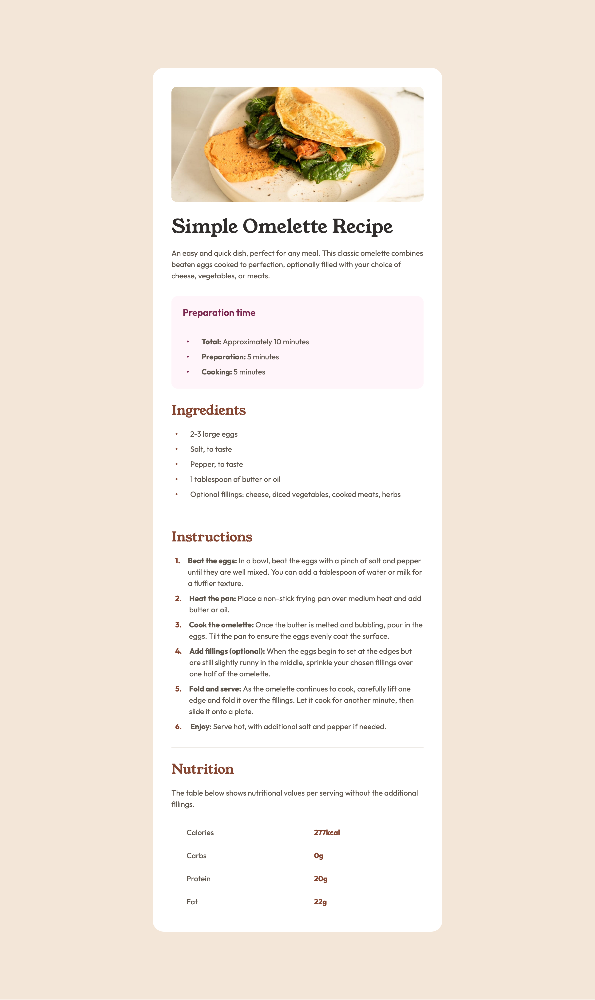

# Frontend Mentor - Recipe page solution

This is a solution to the [Recipe page challenge on Frontend Mentor](https://www.frontendmentor.io/challenges/recipe-page-KiTsR8QQKm). Frontend Mentor challenges help you improve your coding skills by building realistic projects.

## Table of contents

- [Overview](#overview)
  - [Screenshot](#screenshot)
  - [Links](#links)
- [My process](#my-process)
  - [What I learned](#what-i-learned)

**Note: Delete this note and update the table of contents based on what sections you keep.**

## Overview

### Screenshot

### Links

- Frontend Mentor: [Profile](https://www.frontendmentor.io/profile/Donahuec)
- Solution URL: [Github](https://github.com/Donahuec/frontend-mentor-recipe-page)
- Live Site URL: [Github Pages](https://donahuec.github.io/frontend-mentor-recipe-page/)

## My process

### What I learned

- learned about styling custom list markers and using css counters
